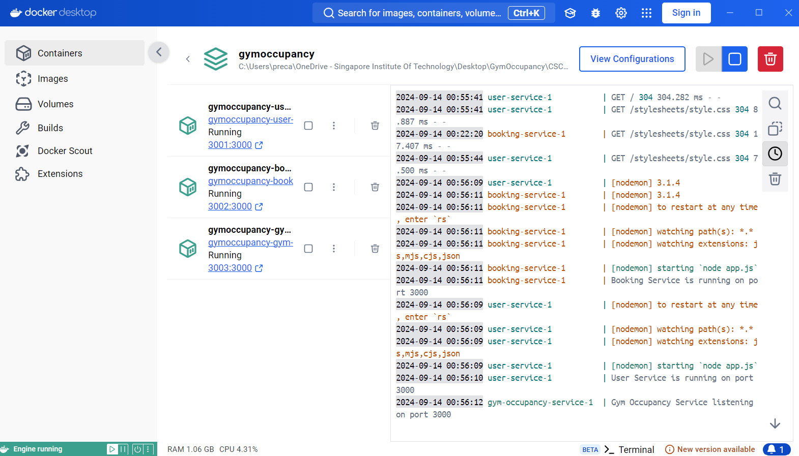
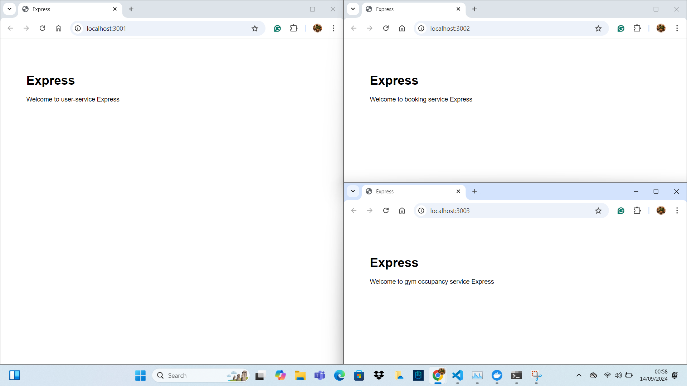

# CSC3104 Cloud and Distributed Computing - Gym Occupancy System

This project is part of the **CSC3104 - Cloud and Distributed Computing** course and involves building a gym occupancy system using multiple microservices. 

## Prerequisites

1. **Install Node.js**: [https://nodejs.org/en](https://nodejs.org/en)
   - You can verify the installation by running:
     ```bash
     node --version
     ```

2. **Install Docker**: [https://www.docker.com/](https://www.docker.com/)
   - Verify Docker installation by running:
     ```bash
     docker --version
     ```

3. **Install Docker Extension in VS Code**:
   - Follow the [VS Code Docker extension guide](https://code.visualstudio.com/docs/containers/quickstart-node) to set up Docker within VS Code.

4. **Launch Docker Desktop**:
   - Make sure Docker Desktop is running.

5. **Run Docker Compose**:
   - Once inside the project directory, run the following command to build and start the services:
     ```bash
     docker-compose up --build
     ```
## Project Architecture TBC more to enhance.....sample only
```
                        +--------------------------------------------------+
                        |            React Frontend (Client App)           |
                        | (Single-page application interacting with APIs)  |
                        +--------------------------------------------------+
                                                |
                                                v
        +--------------------+      +----------------------+      +-----------------------+
        |  User Service      |      |  Booking Service     |      |  Gym Occupancy Service|
        | (Microservice 1)   |      | (Microservice 2)     |      | (Microservice 3)      |
        | - Node.js/Express  |      | - Node.js/Express    |      | - Node.js/Express     |
        | - Handles users    |      | - Handles bookings   |      | - Tracks gym data     |
        +--------------------+      +----------------------+      +-----------------------+
```
## Project Structure
```

├── microservices/                  
│   ├── user-service/                        # User Service Microservice
│   │   ├── src/                             # Source code directory
│   │   │   ├── routes/                      # Route handlers for user requests (Express routes)
│   │   │   ├── views/                       # Views for user service (if using templating)
│   │   │   └── app.js                       # Main server file
│   │   ├── Dockerfile                       # Dockerfile for containerizing the user service
│   │   └── package.json                     # NPM dependencies and scripts for user service
│   │
│   ├── booking-service/                     # Booking Service Microservice
│   │   ├── src/                             # Source code directory
│   │   │   ├── routes/                      # Route handlers for booking requests (Express routes)
│   │   │   ├── views/                       # Views for booking service (if using templating)
│   │   │   └── app.js                       # Main server file
│   │   ├── Dockerfile                       # Dockerfile for containerizing the booking service
│   │   └── package.json                     # NPM dependencies and scripts for booking service
│   │
│   ├── gym-occupancy-service/               # Gym Occupancy Service Microservice
│   │   ├── src/                             # Source code directory
│   │   │   ├── routes/                      # Route handlers for occupancy requests (Express routes)
│   │   │   ├── views/                       # Views for gym occupancy service (if using templating)
│   │   │   └── app.js                       # Main server file
│   │   ├── Dockerfile                       # Dockerfile for containerizing the gym occupancy service
│   │   └── package.json                     # NPM dependencies and scripts for gym occupancy service
│
├── client/                                  # (Optional) Frontend client if using React or another frontend framework
│   ├── src/                                 # Frontend source files
│   ├── public/                              # Public assets such as images, CSS, etc.
│   └── package.json                         # NPM dependencies for the frontend
│
├── kubernetes/                              # Kubernetes Deployment and Service configurations (Optional)
│   ├── user-service-deployment.yaml         # Kubernetes configuration for User Service (TBC)
│   ├── booking-service-deployment.yaml      # Kubernetes configuration for Booking Service (TBC)
│   ├── gym-occupancy-service-deployment.yaml # Kubernetes configuration for Gym Occupancy Service (TBC)
│
├── docker-compose.yml                       # Docker Compose file to orchestrate all services
└── README.md                                # Project documentation
```
## Extra Information

- Useful resources:
  - [React, Express, MongoDB Tutorial 1](https://www.youtube.com/watch?v=w3vs4a03y3I)
  - [React, Express, MongoDB Tutorial 2](https://www.youtube.com/watch?v=mDgKjb5eWPk)
  - [Single-Page Application Explanation](https://www.youtube.com/watch?v=eIxDHgzGCnY)
  - [What is gRPC?](https://www.youtube.com/watch?v=gnchfOojMk4)
  - [VS Code Node.js Docker Quickstart](https://code.visualstudio.com/docs/containers/quickstart-node)
  - [Kubernates in 5 mins](https://www.youtube.com/watch?v=PH-2FfFD2PU)
  - [kubernates by bytebytego](https://www.youtube.com/watch?v=TlHvYWVUZyc)

## Testing the Setup

Once everything is set up correctly, the services should be running on the following ports:

- **User Service**: [http://localhost:3001](http://localhost:3001)
- **Booking Service**: [http://localhost:3002](http://localhost:3002)
- **Gym Occupancy Service**: [http://localhost:3003](http://localhost:3003)

If successful, you should see outputs like the following when visiting these URLs:

-   
-   

      